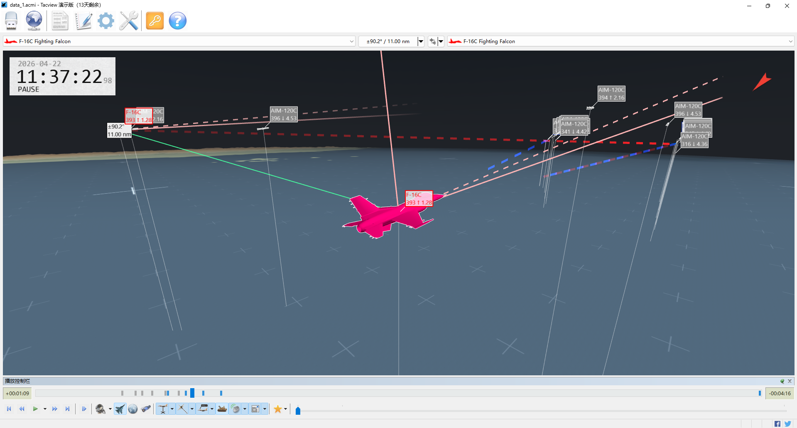

# BVRSim (天穹·空战演武)
*—— 高拟真蜂群无人机超视距空战推演平台*

[](https://www.python.org/)
[](http://jsbsim.sourceforge.net/)
[](LICENSE)

## ✈️ 项目简介

BVRSim 是一个基于开源飞行动力学库 [JSBSim](http://jsbsim.sourceforge.net/) 构建，面向超视距蜂群无人机空战 **策略验证** 的高拟真推演平台。其设计目标并非直接服务于强化学习训练，而是用于检验已训练策略在复杂感知条件下的 **泛化鲁棒性**（即缩小仿真与现实的差距，Sim‑to‑Real Gap）。特别是经参数校准的 AIM-120C-5 空空导弹动力学模型，保留了高速度与有限转弯率之间的物理耦合，避免了强化学习训练环境中常见的过度理想化机动假设。

平台在物理层依托 JSBSim 保证气动与运动学的基本可信度；在感知层人为引入符合统计规律的测量噪声与数据链延迟，从而揭示理想仿真中不易察觉的 **性能退化**。同时集成 Tacview 兼容的 ACMI 日志，便于对交战全过程进行三维复盘。

本平台源于 **第十九届“挑战杯”全国大学生课外学术科技作品竞赛“揭榜挂帅”擂台赛** ——中国航空工业集团沈阳飞机设计研究所发布的《复杂任务下无人机智能协同对抗算法》赛题。作者团队凭借高效、稳定的算法实现和严谨、规范的设计文档，荣获该赛题 **一等奖**。

赛后，作者基于公开资料与开源库独立重构了全部仿真代码，**不包含任何赛事涉密代码或内部数据**，并将其开放为可扩展的对抗仿真框架。

## 🔥 核心定位

与现有平台的对比：

| 平台类型 | 典型代表 | 优势 | 面向策略验证的局限 |
| :--- | :--- | :--- | :--- |
| 军事级推演系统 | AFSim | 极高保真度、权威数据库 | 闭源，难以用 Python 灵活编排与控制大规模并行实验 |
| 通用无人机仿真器 | AirSim、RflySim | 视觉逼真、跨平台 | 缺乏空战专用的传感器噪声与制导链路模型 |
| RL 训练环境 | BVRGym (github)、jsbgym (pypi) | 快速、理想化 | 训练智能体通常依赖完全可观测假设与无偏测量，导致策略过拟合于训练环境的简化特征，泛化能力存疑 |

BVRSim 的定位：提供 **Python 可控接口**，集成 **JSBSim 高保真动力学引擎**，并刻意引入 **非理想感知特征**（噪声、延迟、友伤判定），旨在回答：“*在训练中表现优异的策略，置于更真实的环境中是否依然可靠？*”

## 📦 主要特性

- **高拟真飞行动力学**
  - F-16 战斗机：调用 JSBSim 官方气动数据库，六自由度非线性求解，控制回路采用级联 PID（高度差→体轴 z 分量→俯仰角→升降舵），控制增益经人工整定以满足超视距机动需求。
  - AIM-120C-5 导弹：基于公开资料重构的 `aircraft/aim120c.xml` 配置文件，包含无量纲气动系数、减面燃烧推力表、静不稳定布局（Cmα=+0.25）以及动压调度的角速率阻尼器；外部制导与过载控制由 Python 端 PID 实现，支持 40G 极限过载。

- **特化导弹制导与目标状态估计**
  - 高抛弹道：发射时在载机俯仰角基础上叠加初始爬升角，将火箭能量转化为重力势能，降低超音速飞行的高动压与气动阻力，延长射程。
  - 中制导：比例导引（PN），利用剩余飞行时间（tgo）平滑控制指令，兼顾能量管理。
  - 末制导：扩展比例导引（APN），在 PN 基础上补偿目标法向加速度，可对抗高机动目标。
  - 绝对状态卡尔曼滤波器（9 状态 Singer 模型）：采用 9 阶 Padé 矩阵指数精确离散化、Joseph 形式协方差更新与 PSD 强制正定，在 NED 绝对坐标系下直接估计目标位置、速度、加速度，消除了本机机动与滤波的耦合，并在目标信息中断时自适应增大过程噪声，避免协方差过度收敛。

  详细实现与创新点见后文《飞行器模型真实性设计》章节。

- **非理想感知与数据链建模**
  - 雷达测量噪声：目标距离与速度的标准差随距离平方增长，并利用钳位函数避免异常发散，迫使策略在非理想信息下完成决策。
  - 数据链更新存在周期性丢帧（每 3 个仿真步更新一次雷达数据），模拟实际链路延迟与带宽限制。

- **分布式仿真与友伤判定**
  - 所有飞机及导弹均作为独立实体推进动力学解算，采用空间均匀网格加速邻近点检测。
  - 任意实体间距离小于 15 米即判定为同归于尽，模拟了战场意外碰撞与误击风险。
  - 任意实体超出战场范围立即销毁，并可设置红方飞机禁区（威胁区），模拟敌方防空范围。

- **Tacview 原生可视化**

  自动生成 `.acmi` 日志，支持雷达锁定、导弹轨迹与命中事件的三维回放。下载 [Tacview 免费版](https://www.tacview.net/download/latest/en/) 即可查看。
  

- **依赖自动安装**

  `import bvrsim` 时自动检测并安装 `jsbsim` 及 `numpy`，无需手动配置环境。

## 📁 文件结构
```
BVRSim/
├── .gitignore
├── LICENSE
├── README.md
├── mySim.py         # 示例仿真脚本（继承 bvrsim，重载策略函数）
├── tacview/         # 存放 ACMI 日志文件与预览截图（自动在工作区生成）
├── aircraft/        # JSBSim 飞行器配置目录
│   └── aim120c.xml  # AIM-120C-5 导弹气动/推进/飞控参数定义
└── bvrsim/          # 核心仿真代码包
    ├── init.py      # 数据类（EnemyInfo, DroneInfo, SendData）定义与包入口
    ├── simulate.py  # 仿真主循环、战场边界/威胁区检测、碰撞判定、多进程调度
    ├── drone.py     # 无人机基类（drone）与 F-16 子类，含级联 PID 控制与感知融合
    ├── missile.py   # 导弹基类（missile）与 AIM-120C 子类，含中/末制导律及绝对状态卡尔曼滤波器
    ├── tacview.py   # Tacview ACMI 日志记录（初始化、轨迹、锁定、击毁事件）
    └── utils.py     # 工具模块：PID 控制器、9 状态 Kalman 滤波器、model 基类、坐标转换、矩阵指数等
```
## 📦 环境安装
```bash
git clone https://github.com/numinous-dew/BVRSim.git
cd BVRSim
```
## 🚀 快速开始（mySim.py）
```python
from bvrsim import bvrsim, DroneInfo, SendData
import numpy as np


class mySim(bvrsim):
    def redstrategy(self, info: DroneInfo, step_num: int) -> SendData:
        """红方策略（需返回SendData指令）"""
        cmd = SendData()
        cmd.CmdSpd = 2
        cmd.CmdAlt = 12000
        cmd.CmdHeadingDeg = 180
        cmd.EnemyID = 3  # 攻击/锁定ID=3的敌机
        # 目标信息
        enemy = next((x for x in info.FoundEnemyList if x.EnemyID == cmd.EnemyID), None)
        if not step_num % 200:
            cmd.engage = -1
        elif (
            step_num % 200 == 100
            and enemy
            and enemy.TargetDis < 5e4  # 保证发射距离
            and 1 < np.rad2deg(info.Pitch) < 5  # 保证发射仰角
        ):
            cmd.engage = 1
        return cmd

    def bluestrategy(self, info: DroneInfo, step_num: int) -> SendData:
        """蓝方策略（需返回SendData指令）"""
        cmd = SendData()
        cmd.CmdSpd = 1.2
        cmd.CmdAlt = 11000
        cmd.CmdHeadingDeg = 0
        cmd.EnemyID = 1
        enemy = next((x for x in info.FoundEnemyList if x.EnemyID == cmd.EnemyID), None)
        if not step_num % 100:
            cmd.engage = -1
        elif (
            step_num % 100 == 50
            and enemy
            and enemy.TargetDis < 6e4
            and 1 < np.rad2deg(info.Pitch) < 5
        ):
            cmd.engage = 1
        return cmd


# 战场空间：((纬度范围 deg), (经度范围 deg), (高度范围 m))
field = ((23.0, 26.0), (118.0, 120.0), (2000, 15000))
# 红方防空威胁区：(中心纬度 deg, 中心经度 deg, 高度 m, 半径 m)
threat = ((24.5, 119.0, 0, 50000),)

if __name__ == "__main__":  # 多进程必须
    sim = mySim(field=field, threat=threat)

    # 覆盖双方默认初始兵力参数（纬度、经度、高度、航向、马赫、导弹数、燃油）
    sim.red = [
        dict(lat=24.2, lon=118.2, alt=10000, head=180, mach=0.8, num=4, fuel=5000),
        dict(lat=24.2, lon=118.4, alt=10000, head=180, mach=0.8, num=4, fuel=5000),
    ]
    sim.blue = [
        dict(lat=23.2, lon=118.2, alt=10000, head=0, mach=0.8, num=6, fuel=5000),
        dict(lat=23.2, lon=118.4, alt=10000, head=0, mach=0.8, num=6, fuel=5000),
    ]
    sim.main(time=10)  # 仿真 10 分钟（游戏内时间）
```
## 🧠 核心接口说明

### DroneInfo（本机精确状态）

仿真每步会将本机状态打包为 `DroneInfo` 对象传递给策略函数。
```python
class DroneInfo:
    DroneID: int          # 本机ID
    Latitude: float       # 纬度 (rad)
    Longitude: float      # 经度 (rad)
    Altitude: float       # 高度 (m)
    Yaw: float            # 航向角 (rad)
    Pitch: float          # 俯仰角 (rad)
    Roll: float           # 滚转角 (rad)
    V_N, V_E, V_D: float  # NED速度分量 (m/s)
    A_N, A_E, A_D: float  # NED加速度分量 (m/s²)
    Mach_M: float         # 马赫数
    fuel: float           # 剩余燃油 (lbs)
    AlarmList: list       # 告警列表 [(辐射源ID, 相对方位角, 类型), ...]
    FoundEnemyList: list  # 发现敌机列表 (EnemyInfo对象)
    strike: list          # 本机导弹已击中的目标ID列表（包含敌机、友机或导弹，体现全体友伤设计）
    MissileNowNum: int    # 剩余导弹数量
```
### EnemyInfo（敌机带噪信息）
```python
class EnemyInfo:
    EnemyID: int               # 敌机ID
    isNTS: bool                # 是否已被本机火控锁定
    TargetDis: float           # 距离 (m)
    DisRate: float             # 径向相对速度 (m/s)
    TargetYaw: float           # 水平视线角 (rad)
    TargetPitch: float         # 垂直视线角 (rad)
    vNED: np.ndarray           # NED速度向量 (带噪声)
    TargetMach_M: float        # 估计马赫数
    MissilePowerfulDis: float  # 不可逃逸区距离 (动态计算)
    MissileMaxDis: float       # 最大射程 (动态计算)
```
### SendData（控制指令）

本接口基于赛题控制方式精简，移除冗余指令，保留必要的飞行控制难度。策略函数需返回 `SendData` 对象，以指定期望航向、速度、高度及攻击指令等。
```python
class SendData:
    CmdSpd: float         # 期望马赫数
    CmdAlt: float         # 期望高度 (m)
    CmdHeadingDeg: float  # 绝对方位角 (deg)
    CmdPitchDeg: float    # 最大允许俯仰角 (deg)，较小值用于平稳飞行包线保护，较大值允许高g机动
    CmdPhi: float         # 最大允许滚转角 (deg)，同上
    TurnDirection: int    # 0=就近转, 1=右转, -1=左转
    ThrustLimit: float    # 推力限制 (kN)，默认129
    engage: int           # -1=火控锁定, 1=发射导弹 (仅在从0变为非0时触发一次)
    EnemyID: int          # 目标敌机ID
```
## 🛩️ 飞行器模型真实性设计

本平台在 Python 代码层面严格遵循现代空战仿真对物理真实性的要求，所有模型均依据公开文献与飞行动力学原理实现，以增强仿真推演结果的工程可信度。

### F-16 战斗机模型 (drone.py)

| 设计要素 | 实现方式 | 真实性体现 |
|---------|---------|-----------|
| **飞行动力学核心** | 调用 JSBSim 的 F-16 标准气动数据库 | 六自由度非线性运动方程求解器，气动系数由官方 F-16 模型查表提供 |
| **级联 PID 控制器** | 外环：高度差→体轴 z 分量→俯仰角（`z2pitch`）<br>内环：俯仰角→升降舵（`pitch2ele`）<br>滚转角→副翼（`roll2ail`）<br>马赫数→油门（`mach2thr`） | 采用三回路级联控制架构，符合现代战斗机飞行控制系统的分层设计；控制增益经人工整定，在典型空战机动中响应平滑 |
| **控制限幅与保护** | 俯仰角、滚转角限幅（可解锁至 ±90°）、油门限幅 0.1~1.0 | 模拟了真实飞控的包线保护逻辑，防止指令超出飞行器物理极限；允许用户收紧限制保证平稳飞行，或放宽限制支持高过载机动 |
| **雷达与探测模型** | `radarR` 探测距离（蓝方优势 ×4/3）<br>`radarAngle` 探测半角 | 距离与速度标准差呈非线性增长，模拟雷达回波信噪比随距离增加而衰减的效应，符合典型脉冲多普勒雷达的测距测速统计特性 |

### AIM-120C-5 导弹模型 (missile.py)

| 设计要素 | 实现方式 | 真实性体现 |
|---------|---------|-----------|
| **高拟真气动引擎** | 加载 `aircraft/aim120c.xml` JSBSim 配置文件，含完整气动力/力矩系数、推力表、质量特性 | 气动系数无量纲化，由 JSBSim 结合动压与参考面积（0.274 ft²）计算力与力矩；跨音速阻力峰值 CD0=0.45、升力斜率经马赫/攻角非线性校准、Cmα=+0.25 均参考公开评估报告 |
| **固体火箭发动机** | 推力表基于 112.4 lbs 推进剂、Isp 265 s、燃烧 7.75 s；`<builduptime> 0.15` 秒建压 | 推力曲线呈现：0.15 s 建压 → 约 0.5 s 稳定高推力（3770 lbf）→ 随已燃质量平滑衰减至 7.75 s 耗尽，符合 HTPB 减面燃烧特性 |
| **高抛弹道** | 构造函数在载机俯仰角基础上增加 +5° 初始爬升角（`min(90, 5 + pitch)`），导弹发射后立即进入小角度爬升 | 将固体火箭发动机的能量转化为高度势能，降低超音速飞行的高动压与气动阻力，延长射程；末段俯冲释放势能，提升末端可用过载与拦截窗口 |
| **稳定增强与舵回路** | JSBSim 飞控配置三轴角速率阻尼（增益由 `qbar-psf` 调度）；Python 端 `roll2ail`、`az2ele` 固定增益 PID 将过载指令转化为舵面指令 | 内回路阻尼增强短周期稳定性并抑制高频振荡；外部 PID 与阻尼器协同工作，避免全权自动驾驶仪在极限机动下指令饱和，更贴近真实导弹的“阻尼内回路 + 指令前置”架构 |
| **中制导：比例导引（PN）** | `acmd = N * (v_rel - (v_rel·los)*los) / tgo`，N=4 | 远距时以最小机动消耗预测拦截点，控制指令平滑，符合能量管理原则 |
| **末制导：扩展比例导引（APN）** | `acmd += N/2 * min(1, tgo/2) * (a_rel - (a_rel·los)*los)` | 在 PN 基础上补偿目标法向加速度，可对抗高机动目标；系数 `min(1, tgo/2)` 避免末段指令过激 |
| **绝对状态卡尔曼滤波** | `Kalman` 类实现 9 维（位置、速度、加速度）Singer 模型，直接估计目标在 NED 坐标系下的绝对状态 | 目标运动与导弹运动解耦，滤波器不受本机高过载机动影响；9 阶 Padé 矩阵指数离散化、Joseph 协方差更新、PSD 强制正定，保障长期数值稳定性；目标丢失时自动将机动频率从 0.1 提升至 1.1，防止过度收敛 |
| **主动雷达导引头** | `radarR = 20 km`，`radarAngle = 20°`，末制导（`state==1`）启用以截获目标 | 模拟“发射后不管”，末段自主搜索，参数参考公开资料 |

### 绝对状态卡尔曼滤波器

#### 创新动机

传统机载雷达滤波常采用 **相对坐标系**，其状态量随本机机动剧烈变化，且相对加速度难以计算和预测，非线性强、易发散。本滤波器直接在 **NED 绝对地理坐标系** 下估计目标的绝对位置、绝对速度和绝对加速度，具有以下优点：
- 状态转移矩阵仅与目标运动模型有关，与本机、导弹机动解耦，线性度更好。
- 导弹在快速转弯等高过载时，滤波器的预测步不受自身姿态、速度变化影响，稳定性显著提高。
- 可无缝支持数据链共享目标信息。

#### 基于矩阵指数的离散化 Singer 模型

Singer 模型将目标绝对加速度建模为一阶零均值马尔可夫过程，机动频率 $`\alpha`$ 表征目标机动时间常数的倒数。连续状态方程为：

$$\dot{\mathbf{X}} = \mathbf{A} \mathbf{X} + \mathbf{w}$$

其中，$`\mathbf{X} = [x, \dot{x}, \ddot{x}]^T`$，$`\mathbf{A}`$ 为 3×3 状态矩阵，$`\mathbf{w}`$ 为连续白噪声。

为避免长期仿真中的累积离散化误差，使用 **9 阶 Padé 近似矩阵指数** 计算精确的离散状态转移矩阵：

$$\mathbf{\Phi} = e^{\mathbf{A} \cdot dt}$$

该方法在数值稳定性与计算精度上优于传统的泰勒展开。过程噪声协方差矩阵 $`\mathbf{Q}`$ 通过构造增广矩阵并求其矩阵指数，一步获得离散化后的 $`\mathbf{\Phi}`$ 和 $`\mathbf{Q}`$。

#### 动态调整 Singer 模型的机动频率 $`\alpha`$
- 目标正常跟踪（数据链更新有效）时：$`\alpha`$ = 0.1，对应约 10 s 的机动时间常数，适用于平稳飞行阶段。
- 目标信息缺失（数据链丢帧或雷达未更新）时：$`\alpha`$ 自动增至 1.1，假设目标可能进行转弯或加减速，丢失前的加速度信息迅速衰减，防止滤波器过度自信。

#### Joseph 形式协方差更新

协方差矩阵更新：

$$\mathbf{P} = (\mathbf{I}-\mathbf{K} \mathbf{H}) \mathbf{P} (\mathbf{I}-\mathbf{K} \mathbf{H})^T + \mathbf{K} \mathbf{R} \mathbf{K}^T$$

而非简化形式：$`\mathbf{P} = (\mathbf{I}-\mathbf{K} \mathbf{H}) \mathbf{P}`$。前者具有更好的对称性和正定性保持能力，能有效抵抗计算机舍入误差引起的滤波器发散。

#### $`\mathbf{P}`$ 矩阵半正定强制

每次预测、更新后调用 `psd(P)`，通过特征分解将负特征值置为微小正数并重构矩阵，确保协方差矩阵始终半正定。

#### 对制导性能的提升

采用绝对状态卡尔曼滤波器后，制导律直接利用滤波器输出的目标绝对加速度计算法向分量，用于 APN 补偿。相较于直接使用含噪声的雷达测量值或简单的 $`\alpha`$-$`\beta`$ 滤波，本滤波器能提供：
- 更准确的剩余飞行时间 tgo 估计（基于平滑速度）
- 更精准的目标法向加速度，使 APN 的补偿项更有效
- 更平滑的制导输入，支撑对高机动目标的拦截

## 🎯 应用场景

- **学术研究**：多智能体协同策略在感知受限条件下的**泛化性验证**；环境非平稳性对博弈算法的影响分析。
- **学位论文研究**：对比不同制导律或滤波算法在高拟真环境下的性能差异；飞行控制律的鲁棒性边界测试。
- **强化学习**：作为 **RL 验证** 环境，检测模型是否过拟合于特定训练环境的“捷径特征”（shortcut features）；也可改造为考虑观测不确定性的 **高拟真 RL 训练** 环境，使策略在训练过程中学习应对非理想感知，提升鲁棒性。
- **教学演示**：直观展示超视距空战中信息流传递与延迟的影响。
- **二次开发**：允许修改气动与传感器模型，丰富飞行器选择，作为算法验证的底层基座。

## ⚖️ 开源协议

本平台采用 **MIT License**。你可以自由使用、修改、分发代码，但需保留原作者版权声明。

## 🙏 致谢
- JSBSim 开发团队提供的强大飞行动力学引擎。
- 第十九届“挑战杯”竞赛组委会与中国航空工业集团沈阳飞机设计研究所提供的赛题启发。
- 社区公开的 AIM-120C 性能评估报告（如 "AIM-120C-5 Performance Assessment for Digital Combat Simulation Enhancement, Rev 2"）与 DCS World 相关气动研究，为本模型参数校准提供了关键参考。

## 📬 联系方式

如有问题或合作意向，欢迎通过 GitHub Issue 或邮件（15323122984@163.com）联系作者。

## 免责声明

本平台仅为学术研究与教育目的而开发，**不包含任何国家秘密或受控数据**。所有飞行器参数均来源于公开文献与开源社区推导，与真实装备可能存在差异，用户可自行调整。